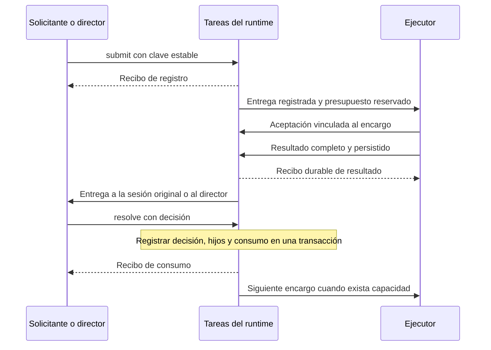

# Encargos y continuaciones comunes para los agentes de Claw

Estado: diseño seleccionado, pendiente de revisión del usuario. Sin implementación ni cambios de producción.

Fecha: 2026-09-30. Base inspeccionada: `origin/main` en `ecd33c5`, PR #232.

## Resultado esperado y alcance

Cualquier agente autorizado puede encargar trabajo a otro agente o a un CLI, recibir el resultado en la sesión correcta y continuar sin que el usuario tenga que recordárselo. El resultado sobrevive a reinicios, no depende de las últimas líneas de una terminal y no se considera atendido hasta registrar la siguiente acción o un desenlace explícito.

El mismo contrato cubre `main`, ingeniería, adversary, operaciones, implementadores, revisores y futuros agentes registrados. Cubrir un agente significa conectar sus rutas de delegación al contrato y probarlas; no basta añadirlo a una lista o modificar su prompt. Las autorizaciones entre agentes y los permisos de herramientas se conservan.

La vigilancia sin novedades no solicita modelos. Los trabajadores propios tienen dueño, límites y cierre verificable. Una conversación archivada, una sesión persistente intencional y un proceso huérfano son objetos distintos.

Este documento especifica tipos, operaciones, propietarios, recuperación y aceptación. No autoriza implementar, instalar, publicar, cambiar cron, cerrar sesiones ni desplegar. Tampoco cambia las reglas vigentes de revisión, merge o despliegue. Un bloqueante repetido en dos rondas conserva el tratamiento exigido por las instrucciones actuales del usuario.

## Base existente y decisión

El [cliente de progreso](../../../scripts/mac/progress-events.py) ya conserva evidencia `LISTO` y `VEREDICTO`, identifica corrida/carril/intento/ronda/SHA, publica desde una cola durable y genera las vistas de una revisión común. Registrar progreso no encarga una corrección.

El [reconciliador](../../../scripts/mac/corrida/reconciliar.sh) y el [diseño del director de corrida](2026-09-29-director-corrida-design.md) son la base de las decisiones de ingeniería. El director sigue decidiendo qué paso corresponde. El sistema común transporta y conserva encargos y resultados; no aprende ni duplica las reglas de rondas, calidad, CI o negocio.

Se elige ampliar las tareas del runtime nativo con registro, admisión, resultados y consumo durables. La bandeja reside en el gateway como parte de esa capacidad nativa. No se construye otro planificador ni una segunda base autoritativa de tareas dentro del plugin del tablero.

La versión inspeccionada, OpenClaw 2026.9.6, no demuestra deduplicación durable completa tras reiniciar. La ampliación del runtime y sus pruebas son una dependencia explícita, no algo que un wrapper o `idempotencyKey` ya resuelvan. Se hará mediante código y migraciones soportadas del runtime; ningún script editará sus tablas internas directamente.

## Uso desde los agentes

Las siguientes interfaces son propuestas y no existen todavía. Los ejemplos son pseudocódigo. `ctx` lo inyecta el runtime a partir de la ejecución autenticada; el modelo no puede redactar una identidad ni escoger una sesión solicitante ajena.

```text
# Ingeniería pide una revisión a adversary.
revision = tasks.submit(ctx, key="pedido-72/revision-r2", assignment={
  target: Agent("adversary"),
  input: CodeRevision(repoId, fullSha),
  instruction: ArtifactRef(brief, digest),
  expected: ReviewResult,
  continuation: ReturnToRequester,
  limits: childLimits
})
# submit registra y organiza la entrega. No hace falta llamar a send después.

# El director usa un revisor CLI y consume su veredicto con código.
revision = tasks.submit(directorCtx, key="corrida-19/B3/r2/review", assignment={
  target: Cli(hostMac, adapterId, worktreeRef),
  input: CodeRevision(repoId, fullSha),
  instruction: ArtifactRef(brief, digest),
  expected: ReviewResult,
  continuation: NotifyDirector(corridaId),
  progressBinding: Round(corridaId, laneId, attemptId, 2),
  limits: reviewLimits
})

# Operaciones pide un diagnóstico; no hay repositorio ni SHA ficticio.
diagnostico = tasks.submit(ctx, key="incidente-81/diagnostico", assignment={
  target: Agent("ingenieria"),
  input: ArtifactRevision(serviceSnapshotRef, digest),
  instruction: ArtifactRef(question, digest),
  expected: OperationalReport,
  continuation: ReturnToRequester,
  limits: childLimits
})

# El consumidor registra la corrección y el consumo juntos.
tasks.resolve(ctx, receipt, Continue([
  NextWork(slot="corregir", assignment=correctionSpec)
]))
# O Complete(evidence), Blocked(reason), Cancelled(reason).
```

`submit` devuelve un recibo de registro, no una afirmación de que el trabajador arrancó. El turno solicitante puede finalizar. La entrega posterior vuelve a esa misma sesión o al director registrado. Se pueden crear hijos para trabajo real autorizado; no se crean hijos para consultar archivos, preguntar si acabó alguien o vigilar una cola.

## Contrato de dominio

El esquema siguiente describe tipos y firmas. No es código ejecutable ni un scaffold.

```text
Caller = AuthenticatedTurn(principal, agentId, sessionInstance, runId)
       | AuthenticatedDirector(authority, corridaId, decisionId, fence)
TaskKey = callerScope + parentTaskId? + logicalRequestKey
Revision = CodeRevision(repoId, fullSha)
         | ArtifactRevision(allowedRef, contentDigest)
Target = Agent(agentId) | Cli(hostId, adapterId, workspaceRef?)
Continuation = ReturnToRequester | NotifyDirector(corridaId)
Assignment = target + instructionRef + inputRevision + resultContract
           + continuation + limits + deadlines + progressBinding?

Task = taskId + taskKey + rootId + parentId? + generation
     + assignmentDigest + verifiedRequester + assignment
     + cancellationRevision + deliveryState + handlingState
FinalResult = Produced(typedPayload, artifactRef, digest, observedRevision)
            | Failed(reasonRef) | ExecutorCancelled(reasonRef)
ReviewResult = reviewedRevision + Approved(evidence)
             | reviewedRevision + Changes(findingsRef)
Incident = PermissionRequired | DeadlineMissed | TransportUnavailable
         | AdmissionUncertain | BudgetReached | CleanupPending
Decision = Continue(nonEmptyList<NextWork>) | Complete(evidence)
         | Blocked(reason) | Cancelled(reason)

submit(Caller, TaskKey, Assignment) -> RegistrationReceipt
report(ProducerCapability, generation, FinalResult) -> ResultReceipt
resolve(Caller, HandlingReceipt, Decision) -> HandlingReceipt
inspect(AuthorizedCaller, TaskId) -> Snapshot                 # no modelo
cancel(AuthorizedCaller, TaskId, reason) -> CancellationReceipt

# Internos al runtime o ejecutor; deliberadamente no implementados.
admit(AdmissionKey, ExecutionTarget, InputRefs, BudgetReservation)
  -> NeverStarted(durableFence) | Admitted(runId) | Uncertain
host.apply(OperationKey, AuthorizedOperation) -> HostObservation
```

Las referencias se validan por propietario, ubicación permitida, tamaño y digest. El texto de un resultado es dato, nunca un comando a ejecutar ni una ampliación de permisos. La credencial de entrega queda ligada al encargo, generación y productor. Los endpoints de consulta también aplican autorización.

Una clave repetida con el mismo contenido recupera el mismo encargo; con contenido distinto devuelve conflicto. `callerScope` identifica al principal y la instancia de sesión, o a la autoridad y corrida del director. El `runId` autentica la llamada, pero no forma parte de la clave estable: recuperarse en otro turno no crea otra tarea. Los hijos de una decisión usan claves derivadas del recibo y del `slot`, no identificadores nuevos en cada reintento. Un nuevo intento de transporte no incrementa la ronda de revisión. Una generación nueva por reemplazo de trabajador no vuelve vigente un resultado de la generación anterior.

Una petición de permiso es una incidencia no terminal; no consume el único resultado final. Los hooks de fin de turno, pantallas quietas y códigos de salida solo provocan observación local. No equivalen a `Produced`, a aprobación ni a permiso concedido. Un resultado válido acredita una declaración del trabajador asociada al encargo; las comprobaciones de calidad y las compuertas siguen verificando su contenido.

## Propietarios y módulos

| Componente | Propiedad exclusiva | Integración prevista |
|---|---|---|
| Tareas del runtime nativo | Identidad, deduplicación, cola durable, consumo, relación padre-hijo, reservas del árbol | Extensión del runtime, API soportada y migración versionada |
| Scheduler nativo | Ejecución y orden de turnos, cola por sesión y reanudación | Se amplía el existente; no hay segundo scheduler |
| Adaptador de host | Procesos locales, cupo de host, captura, spool pendiente y cierre | Adaptador portable con soporte comprobado por sistema operativo; reutiliza lanzadores CLI |
| Director de corrida | Política de ingeniería, decisiones, compuertas y efectos externos | `corrida_worker/reconcile.py` y director previsto, un único consumidor por corrida |
| Agente solicitante | Juicio de negocio cuando una política de código no basta | Recibe resultado y usa `resolve` desde su turno autenticado |
| Progreso | Evidencia y proyecciones del tablero | Cliente y cola `progress-events.py` existentes |

El spool de un host no es otra autoridad de negocio: conserva entregas pendientes hasta el recibo del runtime. El host es autoridad sobre existencia de sus procesos; el runtime es autoridad sobre reservas del árbol. Perder conexión no constituye prueba de ausencia ni libera una reserva.

La superficie pública concentra operaciones completas. El llamador no coordina manualmente enviar, consultar, deduplicar, confirmar y limpiar. El flujo normal cruza consumidor, tareas nativas y ejecutor; los formatos de SSH, tmux, SQLite o del proveedor quedan detrás de sus fronteras.

## Flujo normal y consumo efectivo



Un resultado abre un pendiente de manejo. Admitir el turno de Claw, mostrarle el texto o ver `agent_end` no consume ese pendiente. `resolve` debe crear los siguientes encargos o guardar un desenlace explícito. Un hijo registrado pero sin aceptar sigue visible como entrega pendiente; nunca se informa que ya está trabajando.

En pasos definidos de ingeniería, el director recibe el hecho y decide con código. Primero persiste la decisión con ID estable en su propio registro. `resolve` guarda el recibo y sus hijos atómicamente; si el director cae antes de observar el recibo, repite esa decisión y obtiene el mismo resultado. No mantiene otra bandera autoritativa de consumo. Cuando hace falta juicio, decide el agente solicitante con sus permisos actuales.

Para código, el informe estructurado es la fuente de `round.ready` o `round.verdict`. No se extrae el veredicto del tail. Las versiones y el resultado tipado deben coincidir. Cuando existe `progressBinding`, la misma transacción que acepta el resultado conserva una intención `ProjectionPending` con ID estable de evento, resultado inmutable y destino. El ACK de `report` solo sale después de persistir ambos. El runtime retiene el resultado y su evidencia mientras esa intención esté pendiente.

Un consumidor de código convierte la intención en evidencia y evento mediante el cliente `progress-events.py` existente en el host de publicación registrado. La recepción durable en esa cola se confirma por ID y contenido antes de dar la intención por transferida. Si el ACK se pierde, repetir la transferencia recupera el mismo evento; si el host cae antes de encolarlo, la intención del runtime permite reconstruirlo. No se crea otra proyección de progreso en el runtime: este conserva una obligación de entrega, y la cola existente conserva la publicación hasta que el gateway la acepta.

La proyección se reintenta sin repetir la revisión. Un host de publicación inaccesible mantiene la intención pendiente y visible; la caída del tablero no obliga a repetir una decisión ya registrada. Antes de cualquier borrado automático del hijo, su resultado completo y evidencia deben estar persistidos y confirmados. Los intentos de entrega pendientes impiden eliminar las evidencias que referencian, aunque ya se haya cerrado el proceso del trabajador.

## Estados y fronteras de caída

Entrega, manejo y recurso se almacenan por separado. De ello se deriva la vista; no se usa un único estado `done` para los tres.

```text
Entrega: Registered → WaitingCapacity → Admitting → Accepted → ResultRecorded
Manejo: AwaitingResult → PendingHandling → HandlingAdmitted → Handled(receipt)
Recurso propio: Reserved → Running → StopRequested → AbsenceVerified
Admisión externa: Pending → Admitted | NeedsReconciliation
```

Cancelación y bloqueo guardan causa y revisión. `HandlingAdmitted` sin recibo no es `Handled`. Un encargo no se presenta como completamente cerrado mientras conserve recursos propios sin cierre verificado.

| Frontera | Escritura durable y recuperación exigidas |
|---|---|
| Antes de entregar | Crear tarea, clave única, reserva e intención en una transacción. Un segundo dispatcher recupera lo existente. |
| Entre reservar y lanzar en host | Registrar operación e identidad antes del payload. El lanzador supervisado permite recuperar la instancia por nonce e inicio. Si no se puede atribuir, conservar cupo y conciliar. |
| Entre admitir y recibir respuesta | Consultar admisión por clave durable. Solo `NeverStarted` con exclusión atómica de una solicitud previa autoriza reenviar. Timeout, lease vencido o log vacío no bastan. |
| Entre escribir resultado y ACK | Host escribe completo con renombre y repite el mismo ID. Runtime persiste recepción, pendiente de manejo e intención de proyección cuando corresponda, en una transacción antes de confirmar. |
| Entre decidir y confirmar consumo | Persistir decisión, hijos y recibo juntos. Recuperar las mismas claves; no crear otra revisión del mismo commit por falta de ACK. |
| Después de una herramienta externa | Consultar su efecto por identidad cuando sea posible. Si no se sabe si ocurrió, declarar incertidumbre; no repetirlo por suponer que falló. |
| Cancelación simultánea con resultado | Ordenar ambas transacciones por revisión. Archivar resultados tardíos, impedir nuevas continuaciones de la generación cancelada y propagar cancelación a hijos ya creados. |

Las reclamaciones tienen generación y exclusión. Vencer un lease permite inspeccionar al propietario, no repetir herramientas. El objetivo es una continuación lógica única; no se promete exactamente una ejecución física de una herramienta o proveedor arbitrario.

Una sesión solicitante ocupada conserva su cola nativa. Reiniciar debe reconstruir esa cola y volver a la misma instancia de sesión. Si esa sesión fue eliminada o su propietario ya no es válido, queda un bloqueo de destino; no se inventa una conversación sustituta ni se elige `main` como respaldo.

## Consumo y límite de recuperación

El perfil de límites es obligatorio y finito: concurrencia, profundidad y número total de hijos, llamadas al proveedor, entrada, salida, caché y contexto por petición, además del presupuesto agregado del árbol. Sus valores se fijan con la configuración efectiva del entorno antes de habilitar admisión. No existe un valor implícito ilimitado ni un presupuesto nuevo al abrir un hijo. Un perfil sin límites válidos se rechaza.

Cada llamada reserva antes su máximo permitido. El límite de contexto incluye instrucciones del sistema, historial, herramientas, resultados y adjuntos. El uso reportado liquida la reserva; si falta medición, se conserva la reserva máxima. Las categorías del proveedor se normalizan para no sumar dos veces caché ya incluida en entrada. No se deduce un precio en dinero sin tarifas y facturación verificadas.

El sobre añadido por una entrega tiene un máximo inicial de 8 KiB, con resumen de hasta 1 KiB por resultado y referencias paginables al resto. Esto limita bytes añadidos; no demuestra un contexto total pequeño. Si el contexto efectivo de la sesión excede el presupuesto, la admisión se bloquea con causa. No se abre otra sesión para esquivar el límite.

Transporte, lectura de recibos, conciliación, detección de plazos y limpieza son código. Sin novedades no hay llamadas al modelo. Hooks repetidos y actividad visual no crean eventos de negocio. Los eventos compatibles para el mismo destino pueden agruparse; un lote admitido no cambia su contenido.

La política inicial permite como máximo una recuperación automática adicional con modelo por raíz, solo si se prueba que no repite efectos inciertos y cabe en el presupuesto restante. Revisiones y correcciones legítimas son trabajo nuevo sujeto al presupuesto y a las reglas de rondas, no recuperaciones ilimitadas disfrazadas. Al agotar el límite se guarda un bloqueo; una incidencia repetida no dispara pingpong entre agentes.

Un CLI opaco sin control de sus llamadas puede ofrecer medición posterior, pero no un límite estricto. Para entrar en el modo gestionado con garantía de consumo necesita mediación o una capacidad equivalente comprobada. No se anunciará esa garantía para un ejecutor no certificado. Esta restricción debe figurar en la matriz de compatibilidad, no ocultarse tras el límite de tamaño del aviso.

## Sesiones y procesos: propiedad y cierre

```text
ResourceIdentity = hostId + bootId + runtimeSessionInstance?
                 + processGroup? + processStart? + tmuxServerBirth?
                 + paneId? + registrationNonce
Ownership = TaskCreated | UserAdopted | IntentionalPool(poolId)
ResourceState = Reserved | Running | Closing | AbsenceVerified
              | CleanupPending(reason)
```

Se reserva cupo por host y por árbol antes de crear recursos. Reservas pendientes y procesos en cierre cuentan. La operación compuesta se recupera por ID: si se pierde una respuesta, se consulta la reserva existente. No se mantiene un lock durante llamadas de red. La conciliación recupera o revoca reservas nunca iniciadas solo con prueba de que no existe un lanzamiento anterior capaz de ejecutarse.

Cada hijo se vincula a su raíz. La terminación de un turno del padre no significa abandono; el encargo durable sigue siendo dueño de sus hijos. Antes de crear un reemplazo se cotejan tarea, resultado, instancia y operación de lanzamiento. No se reutiliza identidad por nombre de sesión ni PID a secas.

El cierre propio sigue esta secuencia: persistir evidencia, pedir detención de la instancia identificada, verificar proceso y descendientes atribuibles, registrar prueba de ausencia y liberar cupo. Una señal enviada o un `stop` con retorno cero no bastan. Si hay fallo o host inaccesible, queda `CleanupPending`, se conserva la reserva y la conciliación reintenta con código.

Los ejecutores deben contener o rastrear sus descendientes. Si un proceso puede escapar sin identidad recuperable, el adaptador no supera la certificación de cierre. No se compensa matando procesos por coincidencia de nombre.

Las sesiones `UserAdopted` nunca se matan ni se borran: se retiran únicamente capacidades y marcas propias del encargo. Cada instancia de ejecutor mantiene como máximo un encargo activo; el siguiente espera aceptación real, sin interrumpir trabajo del usuario ni forzar un mensaje encolado. Los workers de un pool intencional mantienen propietario, cupo y plazo de retención aunque no ejecuten una tarea. La retención de historial es independiente. Expirar un plazo no autoriza matar un recurso que aún tiene trabajo o identidad incierta.

El runtime archiva o cierra sus hijos mediante su API soportada después de capturar resultado y cierre. `cleanup: delete` por sí solo no demuestra que un proceso externo terminó. Ninguna limpieza recorre o modifica tablas internas para borrar sesiones que parecen antiguas.

## Observabilidad sin modelos

Una consulta devuelve encargo, propietario, destino, generación, edad, estado de entrega, aceptación real, resultado, recibo de manejo, hijos, reservas y cierres pendientes. Distingue espera de capacidad, transporte caído, resultado inválido, sesión ocupada y admisión incierta. No presenta una espera como avance.

Se registran por raíz solicitudes al proveedor, entrada/salida/caché, contexto efectivo, duplicados descartados, recuperaciones, recursos reservados/vivos/en cierre y duración de cada frontera. El contador de proveedor usado en aceptación es independiente del contador del servicio.

Objetivos iniciales con hosts despiertos y red sana: detectar un informe estable en hasta 5 segundos y recibirlo en hasta 5 segundos adicionales. Una espera sin avance se hace visible en hasta 120 segundos con su causa. Inicio y final de un turno ocupado se miden por separado; no se prometen esos tiempos para la inferencia. El estado es consultable siempre que el host dueño esté accesible. Cualquier aviso externo usa únicamente un canal previamente autorizado y no genera un turno periódico de modelo.

## Integración con diseños anteriores

El diseño previo `cli-eventos.v1` aportó informes portables, cola local, bandeja durable y recibo de consumo. Aquí su destinatario fijo `main` pasa a identidad autenticada de cualquier solicitante; la autoridad de tareas queda dentro del runtime. No se implementarán dos bandejas competidoras.

El director U3b conserva las decisiones del flujo de ingeniería. Su propuesta de sesiones supervisoras `dir-<id>` y empujones por silencio no se hereda en los encargos gestionados por este contrato. Sus excepciones se entregan a su propietario registrado. Las políticas de calidad no se modifican mediante el transporte.

El tablero conserva el contrato de progreso de PR #232. El evento de resultado sirve tanto al manejo del encargo como a la proyección, con identidades enlazadas y reintento durable; ninguna publicación exitosa prueba que un trabajador haya comenzado.

## Adopción y reversa

1. Inventariar entradas nativas, CLI, helpers, cron técnicos y sus reparadores. Registrar capacidades reales de admisión, presupuesto y cierre por adaptador. Los cron de negocio siguen cumpliendo su función; solo su delegación, cuando exista, entra por el contrato común.
2. Probar ampliación nativa y adaptadores en perfil aislado con proveedor simulado. Captura y diagnóstico pueden prepararse sin habilitar admisiones nuevas.
3. Adoptar encargos actuales sin reiniciar sus sesiones. Clasificar cada resultado como ya atendido, pendiente vigente o generación anterior. Conservar identidad y evidencia; los casos dudosos quedan visibles.
4. Transferir cada entrada mediante una generación de configuración que impida dos emisores activos. Drenar avisos y turnos en vuelo antes de habilitar el nuevo consumidor. Una admisión incierta impide transferir ese encargo a ciegas.
5. Tras demostrar entrega y consumo, retirar los despertares anteriores de esa entrada y actualizar lanzadores, skills, prompts y reparadores para que no los reconstruyan. El perímetro gestionado debe rechazar delegaciones sin identidad y política registradas.
6. La reversa congela admisiones nuevas, conserva resultados y concilia pendientes antes de devolver propiedad. Nunca reactiva automáticamente los cron costosos ni reproduce lotes inciertos.

No se promete cobertura universal mientras exista una entrada gestionada que pueda delegar por fuera. La matriz de entrega incluye agente origen/destino, sesión, host, ejecutor, política de permisos, modo de presupuesto y cierre. Es una evidencia de habilitación, no una lista aspiracional.

## Pruebas de aceptación para la implementación futura

Ninguna de estas pruebas se ejecuta como parte de este diseño.

| Escenario | Aserción observable |
|---|---|
| C2-r1: veredicto fuera del tail de 80 líneas | Una corrección registrada y aceptada; nunca nueva revisión del mismo SHA por ausencia visual. |
| Misma entrega reenviada 100 veces y ACK perdido | Un resultado, un consumo lógico y los mismos hijos; ninguna admisión extra causada por duplicados. |
| Caída antes/después de registro, admisión, resultado y consumo | Recuperación desde evidencia durable o bloqueo explícito; ningún `Handled` sin decisión. |
| Turno del solicitante termina sin `resolve` | Resultado sigue pendiente y recuperación acotada; `agent_end` no lo consume. |
| Sesión ocupada, gateway reiniciado y dueño eliminado | Cola a la sesión original; si ya no existe, bloqueo sin sesión sustituta. |
| Dos dispatchers, cancelación y callback viejo | Un orden durable; ninguna continuación de la generación cancelada ni efecto duplicado. |
| Ingeniería → adversary, operaciones → ingeniería y CLI en otro host | Resultado al dueño correcto, operaciones sin SHA, suplantación y delegación no permitida rechazadas. |
| 72 horas simuladas sin novedades, reconexiones y hooks repetidos | Cero peticiones al proveedor atribuibles a vigilancia y cero sesiones creadas para sondear. |
| Árbol de hijos, contexto grande y uso de caché | Reservas y límites heredados; no reinicio de presupuesto por hijo o recuperación. |
| CLI sin control de llamadas | No se habilita la garantía estricta de presupuesto ni se anuncia como certificado. |
| Caída entre reserva y lanzamiento, host dormido o inaccesible | No se libera cupo ni se crea reemplazo por falta de respuesta. |
| PID reutilizado, descendiente desacoplado y sesión del usuario | Nunca se mata recurso ajeno; falta de contención impide certificar cierre. |
| Stop falla y luego se recupera | `CleanupPending` conserva cupo; solo ausencia verificada lo libera. |
| Cien ciclos de encargos terminados | Recursos activos dentro del límite; cero procesos propios abandonados. Historial y pool intencional contabilizados aparte. |
| Tablero caído durante una revisión | Resultado y continuación sobreviven; la proyección converge sin repetir trabajo. |
| Caída tras ACK de resultado y antes de encolar progreso, o pérdida del ACK de transferencia | `ProjectionPending` reconstruye o recupera el mismo evento; no se pierde la actualización ni se elimina su evidencia. |
| Takeover y reversa con eventos en vuelo | Ninguna entrega perdida ni segundo consumidor activo del mismo encargo. |

La prueba viva posterior será acotada: dos entregas controladas y una incidencia de permiso sin aprobarla, con contadores externos de proveedor, sesiones y procesos. Antes de declararlo terminado deben pasar los candados del repositorio y la batería requerida sobre el SHA final, sin omisiones. La prueba de publicación del tablero sola no satisface esta aceptación.

## Puertas técnicas y primer paso futuro

Tres capacidades deben demostrarse antes de habilitar el circuito: transacción durable de admisión y consulta; identidad de ejecución verificable para entrega y consumo; presupuesto y cierre efectivos para cada ejecutor. Si la versión instalada no las ofrece, se amplía y versiona el runtime de forma explícita. No se oculta esa dependencia con una base privada que vuelva a coordinar el mismo turno.

La primera tarea futura será probar esas fronteras en un perfil aislado con proveedor falso y reinicios entre cada escritura. Después se podrá escribir el plan de implementación contra este contrato. Este diseño no ejecuta esa tarea.

La [decisión de arquitectura](2026-09-30-encargos-agentes-rationale.md) registra las alternativas, puntuaciones, integración de propuestas y límites conocidos.
